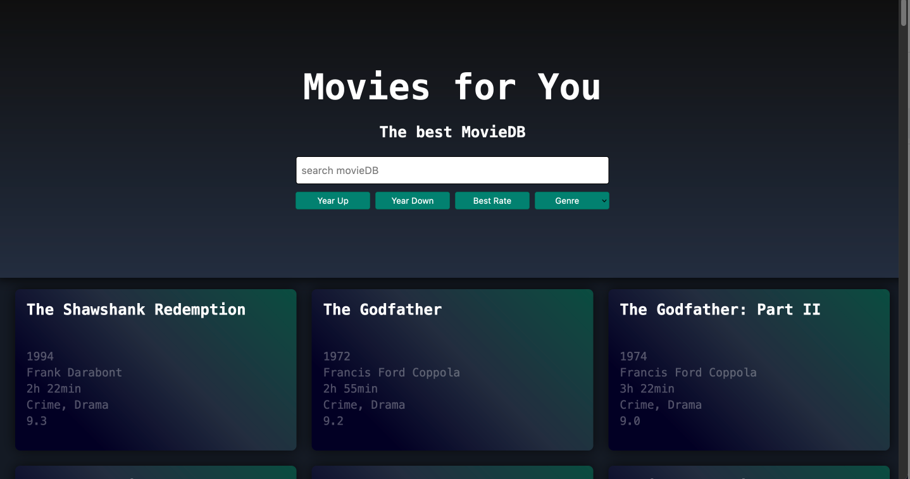

# JavaScript Project: Movie Database

Description
This JavaScript project was created as part of a fullstack web dev bootcamp at supercode.de. It is a movie database where films are displayed as a gallery from an array.

# The application provides the following features

- Search for a specific movie
- Sorting the database by release year (ascending/descending), by rating, and by genre

# How it works

Enter the movie title or part of it into the search field. If there are matches in the database, they will be displayed. If no match is found, a message will indicate that the sought-after title could not be found.

To sort the movie database, click on the corresponding "Year Up," "Year Down," or "Best Rate" button. For genre search, click on a genre in the selection window. The database will be sorted accordingly and displayed as a gallery.

# Tech Stack

- HTML5
- SASS
- Vanilla JavaScript

# Screenshot

# GitHub Live Preview

https://yacineyldrm.github.io/Project_movieDB/

# GitHub Repository

https://github.com/YacineYldrm/Project_movieDB

# Flowchart

# Notes

This project was created as part of a coding bootcamp at supercode.de. The application allows for easy and quick searching in a movie database and sorting of films. The README.md file also serves as an application document, showcasing my skills in web development.
